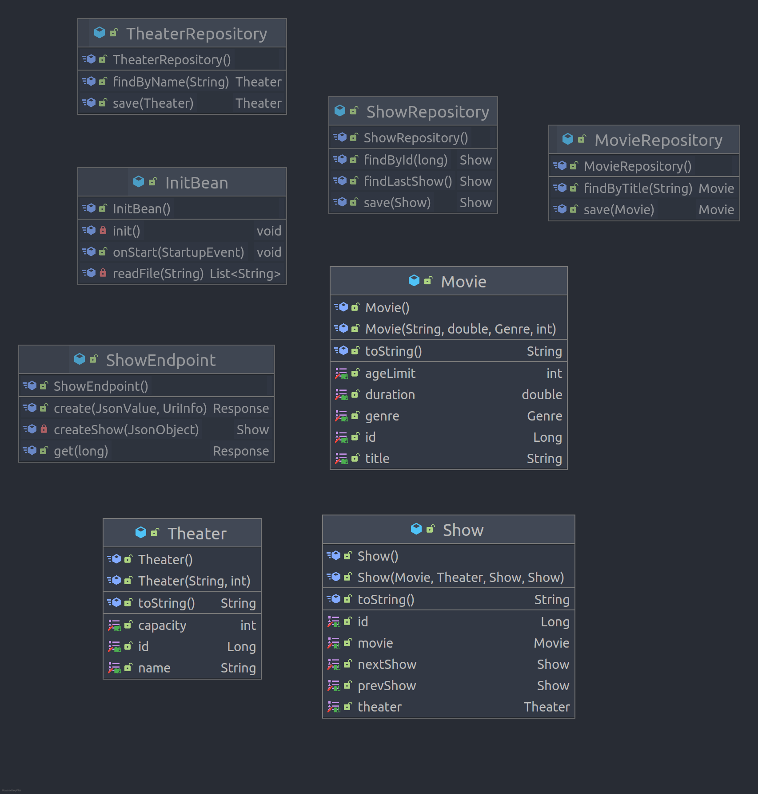
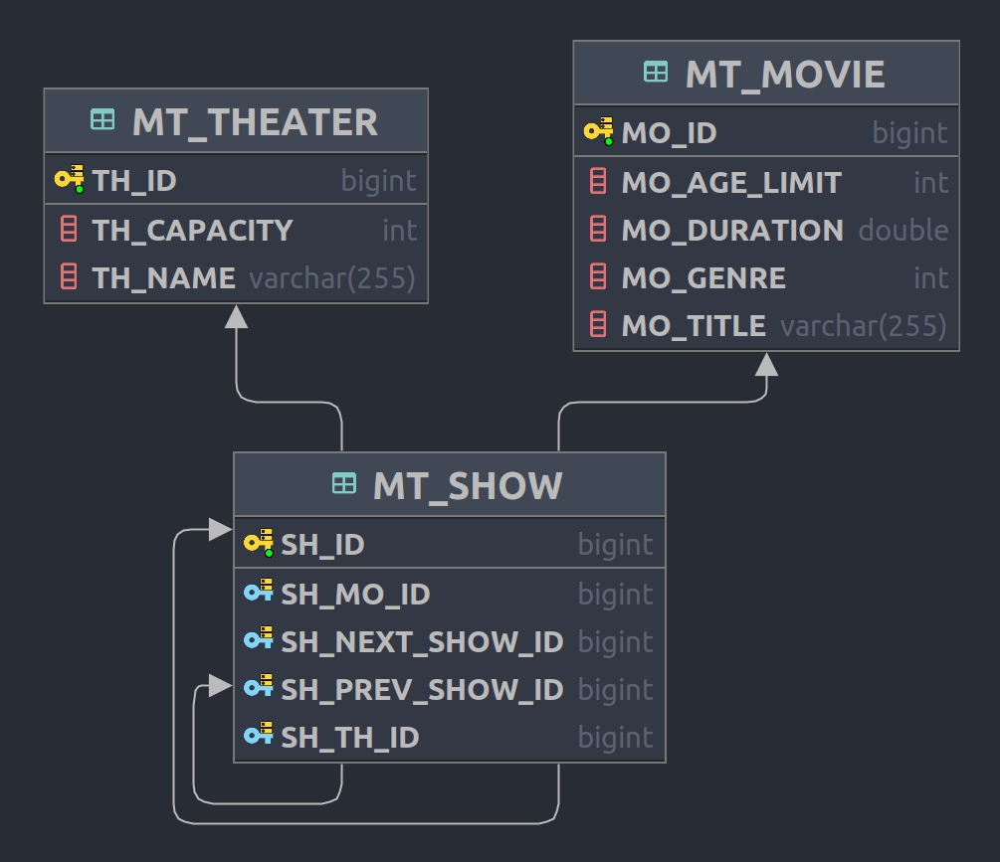

# movie-theater

> exam exercise by Jonas Dorfinger

[TOC]

## Introdcution

You are going to implement a simple movie-theater program management tool.

This is an advanced exercise, it includes all learned topics (except writing unit tests), if you complete this project, you are very well prepared for you exam! If not, don't worry, you are still able to pass the exam.

 

## What you'll have to use

- DerbyDB
- Hibernate ORM
- Json-B
- Json-P
- Resteasy
- JPQL
- NamedQueries
- JsonValue

## Step 1: Create Project

Acquire your ready-to-go project, using [this link](https://github.com/dorfingerjonas/movie-theater-template/generate).

There are two `.sh` files in you project root directory, use them to create and start your derby db. Afterwards create your database locally in IntelliJ.

If this all works fine for you, start your project for the very first time.

Now, you can read my description mindfully

**Important:** Do not forgot to commit regularly!

## Step 2: CLD and ERD

### CLD

### ERD

## Step 3: Entities

### Genre

this one has already been done for you

### Movie

- the table should be called `MT_MOVIE`
- generate an id
- the required column names are shown in the ERD.

### Theater

- the table should be called `MT_MOVIE`
- generate an id
- the required column names are shown in the ERD.
- column name should be unique

### Show

- the table should be called `MT_SHOW`
- use a custom sequence called `showSeq` and with an initialValue off 1000 to generate an id
- the required column names are shown in the ERD.
- add the required Annotations to the columns

_hint: You may need @ManyToOne and @JoinColumn_

## Step 4: Repositories

The `InitBean.java` has been done for you, read it carefully and try to understand what the code actually does!

### MovieRepository

- make sure to add all missing Annotations

- implement a save() method, which should just merge our movie to the db without any validations

- findByTitle()

  - implement a NamedQuery in `Movie.java` named `Movie.findByTitle`

  _hint: you may need a TypedQuery_

### TheaterRepository

- make sure to add all missing Annotations

- findByName()

  - implement a NamedQuery in `Theater.java` named `Theater.findByName`

  _hint: you may need a TypedQuery_

### ShowRepository

- make sure to add all missing Annotations

- findLastShow()

  - implement a NamedQuery in `Show.java` named `Show.findLastShow`

  _hint: you may need a TypedQuery_

  _hint: you can set the amount of max results of an query_

- save()

  - at first, merge the show object

  - first if statement, check if the `prevShow` is null, if so, set the `prevShow` with the return value of `findLastShow()`

  - second if statement, if the `prevShow` is not null, set the `nextShow` of the `prevShow` to the `show`

    _hint: `show.getPrevShow().setNextShow(show);`_

  - return the show object

  _hint: make sure, the 2 if statements are indepented from each other (no if else-if)_

## Step 5: Endpoints

### ShowEndpoints

make sure, the now implemented endpoints are available under the `/show` path

#### Endpoint 1: Create Show

use the appropriate http method (GET, POST, DELETE or PUT)

the first param is a `JsonValue`, which can be either an JsonArray, JsonObject, ... .

Implement an algorithm to support both, JsonArrays and JsonObjects, all other types can be ignored. The algorithm should be able to save single objects and all elements of an array to the database. 

In every case of an error or some unexpected stuff, return an status code of 400 (Bad Request)

make sure to parse the fields of the json object to java objects

if the show object is created, return a Response with status code 201 (Created) and an absolute uri path with the id, to find the show by its id

### Endpoint 2: Find Show by its id

use the appropriate http method (GET, POST, DELETE or PUT)

make sure to add the missing Annotations

use the `JsonObjectBuilder` to build a custom a json object with the `id` of the show, the `title` of the movie and the name of the `theater`

return status code 200 (ok)

There are requests prepared to test your endoints, the first two should work, the other should return a status code 400

# Closing words

If you have completed this task - well done, respect! It took me like more than 5 hours to think about the project, implement a correct solution and write this bad documentation (sorry about that).

If you have any further question or discovered some mistakes of myself, feel free to get in touch with me!